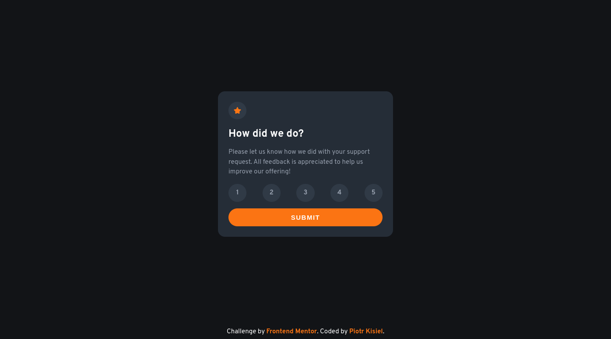
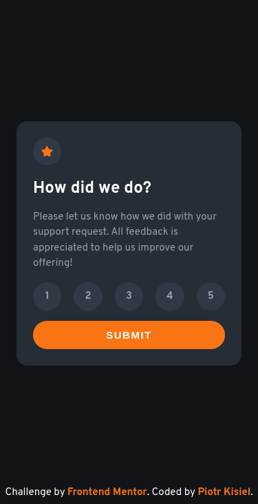

# Frontend Mentor - Interactive rating component solution

This is a solution to the [Interactive rating component challenge on Frontend Mentor](https://www.frontendmentor.io/challenges/interactive-rating-component-koxpeBUmI)

## Table of contents

-   [Overview](#overview)
    -   [The challenge](#the-challenge)
    -   [Screenshot](#screenshot)
        -   [Desktop view](#desktop-view)
        -   [Mobile view](#mobile-view)
    -   [Links](#links)
-   [My process](#my-process)
    -   [Built with](#built-with)
-   [Author](#author)

## Overview

### The challenge

Users should be able to:

-   View the optimal layout for the app depending on their device's screen size
-   See hover states for all interactive elements on the page
-   Select and submit a number rating
-   See the "Thank you" card state after submitting a rating

### Screenshot

#### Desktop view

#### Mobile view

### Links

-   [Solution URL](https://github.com/pietyr/interactive-rating-component)
-   [Live Site URL](https://pietyr.github.io/interactive-rating-component/)

## My process

### Built with

-   Semantic HTML5 markup
-   CSS custom properties
-   Flexbox
-   Mobile-first workflow
-   JavaScript

## Author

-   GitHub [@pietyr](https://github.com/pietyr)
-   Frontend Mentor - [@pietyr](https://www.frontendmentor.io/profile/pietyr)
